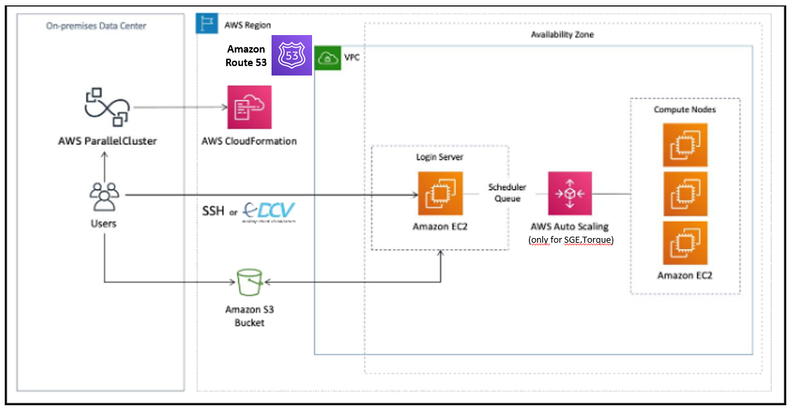
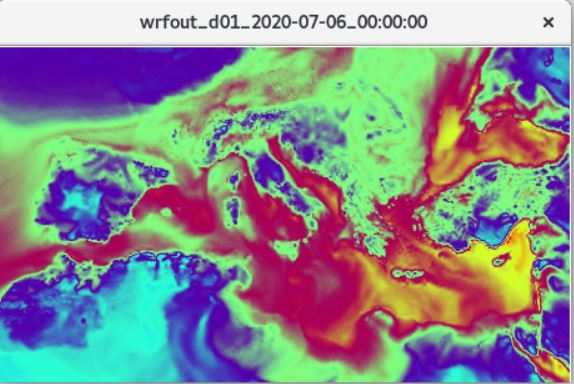
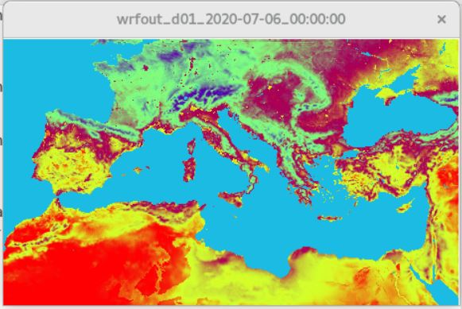
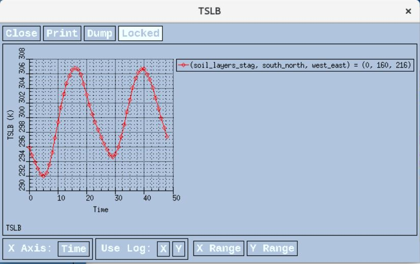

# HPC WORKSHOP WRF ON AWS

## Introduction

The **Weather Research and Forecasting (WRF)** Model is a next-generation mesoscale numerical weather prediction system designed for both atmospheric research and operational forecasting applications.

If you are looking for additional information, please refer to:
* Main Web Site: http://www.wrf-model.org
* V3 User Guide: http://www2.mmm.ucar.edu/wrf/users/docs/user_guide_V3/contents.html
* WRF Modeling System Overview - http://www2.mmm.ucar.edu/wrf/users/tutorial/201601/overview.pdf
* Benchmark results running large scale Weather Forecast models on AWS: https://aws.amazon.com/it/solutions/case-studies/maxar-case-study/

In this workshop we will set-up a Elastic HPC cluster, leveraging *AWS ParallelCluster*, 
that can immediately be used to start running weather forecasts.  
Scripts included in this repo are released under MIT license and perform all required tasks
to download and compile required dependencies and tools needed to be able to run 
a full weather forecast from initialization data download to visualization of outcomes.

This workshop complements the webinar that has been presented during the [HPC on AWS Virtual Event](https://youtu.be/ZxrspLi28hw).

## Security

See [CONTRIBUTING](CONTRIBUTING.md#security-issue-notifications) for more information.

## License

This library is licensed under the MIT-0 License. See the LICENSE file.

## Cluster Setup with AWS ParallelCluster

The first step is to install AWS ParallelCluster console according to the following guide: https://docs.aws.amazon.com/parallelcluster/latest/ug/install-virtualenv.html

Once you have AWS ParallelCluster installed (and activated if you are installing it in a Python Virtual Env), the next step is to 
move to the directory generated by git when cloning the repo and create an S3 bucket to store AWS ParallelCluster 
post install script and copy it to the bucket:

```bash
cd <PATH-TO-THE-GIT-REPO>
export BUCKET_NAME=<POST-INSTALL-SCRIPT-BUCKET-NAME>
export REGION=<REGION>
aws s3 mb  s3://${BUCKET_NAME} --region=${REGION}
aws s3 cp pc_setup_scripts/git_download_and_run.sh  s3://${BUCKET_NAME}
```
Post install scripts are executed on each and every node of the cluster at boot time after all AWS Parallel cluster 
software packages are installed and before the node will become ready.
In this workshop post install script will take care of setting up Master node downloading, compiling and installing 
all WRF related software components and configure Compute nodes in order to adjust linux limits to be able to cope 
with stack and memory requirements from WRF.

Now it is time to configure AWS ParallelCluster according to our needs.
This is done by editing  the template file provided in this repo: *pc_setup_scripts/pcluster-config.template*  
and adjusting parameters related to AWS account, region and VPC.

Depending on the target processor faminy x64 or Graviton2 follow adjust the configuration parameter accordingly:  
- [Configuring for x64](#x86-64)
- [Configuring for Graviton2](#Graviton2)

<a id="x86-64"></a>
### Configuring for x64 

*pc_setup_scripts/pcluster-config.template* you will find cluster settings that provides good results with WRF and also for many other tightly coupled compute intensive algorithms, 
key configuration parameters are:
* using c5n.18xlarge instances for compute nodes. Those instances have a low memory to CPU ratio but Intel CPU up to 3.4 Ghz sustained clock speed and 100 Gbps network interfaces with EFA
* diable Hyperthreading
* enabling EFA to take advantage of low latency networking for distributed computing
* configuring all compute nodes in the same placement group to further reduce latency due to physical distance among hosts
* enabling [DCV](https://docs.aws.amazon.com/dcv/latest/adminguide/what-is-dcv.html) in order to be able to visualize computational results directly from the Master node
* limiting maximum number of nodes to 6 (to avoid generating unexpected large clusters)
* configuring 0 compute node at rest (all compute nodes are shut down whene there are no job submitted to the scheduler)

For remaining AWS ParallelCluster configuration parameters we will use the default values (do not need to specify them in the config file).  

### Warning  
* Several of these settings will result in higher cost.  Please review [EC2 costs](https://aws.amazon.com/ec2/pricing/) prior creation.  
* Region has to be selected according to [Amazon Elastic Compute Cloud (EC2) C5n Instances availability](https://aws.amazon.com/it/about-aws/global-infrastructure/regional-product-services).

```bash
[aws]
aws_region_name = <REGION>

[cluster wrfCluster]
dcv_settings = custom-dcv
compute_root_volume_size = 35
enable_efa = compute
key_name = <EC2 KEY NAME>
vpc_settings = public
compute_instance_type = c5n.18xlarge
master_instance_type = c5n.xlarge
disable_hyperthreading = true
initial_queue_size = 0
maintain_initial_size = true
max_queue_size = 24
master_root_volume_size = 50
cluster_type = ondemand
placement = cluster
placement_group = DYNAMIC
base_os = alinux2
ebs_settings = custom
s3_read_write_resource =  arn:aws:s3:::<POST-INSTALL-SCRIPT-BUCKET-NAME>/*
post_install = s3://<POST-INSTALL-SCRIPT-BUCKET-NAME>/git_download_and_run.sh
post_install_args = https://github.com/aws-samples/hpc-workshop-wrf.git,setup.sh 


[vpc public]
vpc_id = <VPC ID>
master_subnet_id = <SUBNET ID>

[ebs custom]
volume_type = gp2
volume_size = 100
shared_dir=/shared

[dcv custom-dcv]
enable = master

[global]
cluster_template = wrfCluster
update_check = true
sanity_check = true

[aliases]
ssh = ssh {CFN_USER}@{MASTER_IP} {ARGS}

```  
go to [Create Cluster](#CreateCluster)

<a id="Graviton2"></a>
### Configuring for Graviton2  

*pc_setup_scripts/pcluster-config.template* you will find cluster settings that provides good results with WRF and also for many other tightly coupled compute intensive algorithms, 
key configuration parameters are:
* using c6gn.16xlarge instances for compute nodes. Those instances have a low memory to CPU ratio but Graviton2 ARM cpu and 100 Gbps network interfaces with EFA
* enabling EFA to take advantage of low latency networking for distributed computing
* configuring all compute nodes in the same placement group to further reduce latency due to physical distance among hosts
* enabling [DCV](https://docs.aws.amazon.com/dcv/latest/adminguide/what-is-dcv.html) in order to be able to visualize computational results directly from the Master node
* limiting maximum number of nodes to 6 (to avoid generating unexpected large clusters)
* configuring 0 compute node at rest (all compute nodes are shut down whene there are no job submitted to the scheduler)

For remaining AWS ParallelCluster configuration parameters we will use the default values (do not need to specify them in the config file).  

### Warning  
* Several of these settings will result in higher cost.  Please review [EC2 costs](https://aws.amazon.com/ec2/pricing/) prior creation.  
* Region has to be selected according to [Amazon Elastic Compute Cloud (EC2) C5n Instances availability](https://aws.amazon.com/it/about-aws/global-infrastructure/regional-product-services).

```bash
[aws]
aws_region_name = <REGION>

[cluster wrfCluster]
dcv_settings = custom-dcv
compute_root_volume_size = 35
enable_efa = compute
key_name = <EC2 KEY NAME>
vpc_settings = public
compute_instance_type = c6gn.16xlarge
master_instance_type = c6gn.xlarge
initial_queue_size = 0
maintain_initial_size = true
max_queue_size = 24
master_root_volume_size = 50
cluster_type = ondemand
placement = cluster
placement_group = DYNAMIC
base_os = alinux2
ebs_settings = custom
s3_read_write_resource =  arn:aws:s3:::<POST-INSTALL-SCRIPT-BUCKET-NAME>/*
post_install = s3://<POST-INSTALL-SCRIPT-BUCKET-NAME>/git_download_and_run.sh
post_install_args = https://github.com/aws-samples/hpc-workshop-wrf.git,setup_arm.sh 


[vpc public]
vpc_id = <VPC ID>
master_subnet_id = <SUBNET ID>

[ebs custom]
volume_type = gp2
volume_size = 100
shared_dir=/shared

[dcv custom-dcv]
enable = master

[global]
cluster_template = wrfCluster
update_check = true
sanity_check = true

[aliases]
ssh = ssh {CFN_USER}@{MASTER_IP} {ARGS}

```

<a id="#CreateCluster"></a>
## Create the cluster
We are now ready to use AWS ParallelCluster to spin up our new cluster for running weather forecasts by tiping:
```bash
mkdir -p $HOME/.parallelcluster
cp ./pc_setup_scripts/pcluster-config.template $HOME/.parallelcluster/config
pcluster create wrf-workshop
```

AWS ParallelCluster will create the components highlighted in the following picture, by leveraging AWS CloudFormation:  
    
Cluster spin-up will require approximately 30 minutes due to download of WRF source components and following compile and build process.


## Log into the cluster using DCV
Once the cluster is up and running we can now log onto it leveraging DCV.
DCV allows a logging onto the Master node using a web browser and a signed url returned by following command:
```bash
pcluster dcv connect --key-path <PATH TO EC2 KEY NAME.pem> wrf-workshop
```

## Run a weather forecast simulation

### Setup Environment variables
Load environment variables related to WRF set-up:
```bash
source /shared/setup_env.sh
```
This step has to be executed for each and every new window/session we open on the master node.  
You can avoud it by appending that command to ~./bashrc
```bash
echo "source /shared/setup_env.sh" >>  ~/.bashrc
echo "echo 'WRF ENVIRONMENT INITIALIZED'" >>  ~/.bashrc

```

### Download reference data
In order to be able to run a weather forecast on a specific region we need:
* Static Geographical Data: How soil is in that region (i.e. lakes, forests, cities, hills, snow, mountains,...) that varies according to seasonality
* Gridded Meteorological Data coming from a large scale, gross grained, forecasting system that will set-up our starting condition.

#### Download soil reference data
This procedure has to be run once, since soil data are slowly changing over time (i.e.: new cities, deforestation).
It takes about 1 hour to download and unzip the contents
```bash
download_and_install_geog_data.sh
```

#### Download Gridded Meteorological Data.
The Global Forecast System (GFS) is a weather forecast model produced by the National Centers for Environmental Prediction (NCEP). 
The entire globe is covered by the GFS at a base horizontal resolution of 18 miles (28 kilometers) between grid points, which is used by the operational forecasters who predict weather out to 16 days in the future. Horizontal resolution drops to 44 miles (70 kilometers) between grid point for forecasts between one week and two weeks.
Gridded data are available for download through the NOAA National Operational Model Archive and Distribution System (NOMADS).
As with most works of the U.S. government, GFS data is not copyrighted and is available for free in the public domain under provisions of U.S. law.  
Because of this, the model serves as the basis for the forecasts of numerous private, commercial, and foreign weather companies.  

GFS data can be downloaded using the following script and are related to the date when this script is run. 
This script should run every time we want to make a new forecast for the next coming days.
```bash
get_noaa_grib_files.sh
```
Downloaded data are saved in: /shared/FORECAST/download/<current date>

### Configure specific geographic area to cover with the forecast
The next step is to set-up program configuration data (i.e. namelist.wps and namelist.input)
according to the area and the timeframe for which we want to run our forecast.
The following script automatically generates required configuration files 
for a map centered on the Mediterranean sea (latitude 40, longitude 14) covering central and south Europe and north Africa.
```bash
prepare_config.sh
```

### Generate reference data for selected domain
In this step, we extract relevant data to us.
We first set-up some environment variables:
```bash


ulimit -s unlimited

NP=$(ls /sys/class/cpuid/ | wc -l)
NP=$(( $NP / 2 ))

day=$(date +%Y%m%d)

WPSWORK=${TARGET_DIR}/preproc
WRFWORK=${TARGET_DIR}/run
DIRGFS=${SHARED_DIR}/FORECAST/download/$day

cd $WPSWORK
#Cleanup data related to previous run (in case they exists)
rm -f FILE*
rm -f PFILE*
rm -f met_em*
```
geogrid extracts relevant soil data from global dataset
```bash
./geogrid.exe > geogrid.$day.log 2>&1

```

GFS data are then copied to preprocessing directory in order to be filtered for our region on interest
```bash
cd $DIRGFS
cp -f GRIBFILE* $WPSWORK

cd $WPSWORK

./ungrib.exe > ungrib.$day.log 2>&1

```
and mix them with soil related data
```bash
./metgrid.exe > metgrid.$day.log 2>&1

mv met_em* $WRFWORK

```
 
### Run Weather Forecast
Last data preparation step is performed by real.exe that prepares Initial and Boundary Conditions files for later processing.
```bash
cd $WRFWORK
./real.exe  >real.$day.log 2>&1
```

We are now ready to submit a WRF job using pre-installed scheduler (i.e. SLURM)
```bash
sbatch --ntasks 72  ${SCRIPTDIR}/slurm_run_wrf.sh
```
With this statement we are asking to the scheduler to run the job on a 72 physical cores,
integration among scheduler and AWS ParallelCluster checks if thre are enough resoruces to accomodate this job and, if not, spin up a number of new instances according to job needs.
Output and log files are saved under $WRFWORK directory.

We can run the same forecast using a different number of cores in order to be able to understand how WRF scales on AWS.

Further more, AWS ParallelCluster allows two different usage scenario:
- Single AWS ParallelCluster used to run multiple jobs in parallel leveraging Job schedulers
- Multiple AWS ParallelCluster running jobs indipendently

this, together with virtually unlimited resources available on AWS, allows running multiple forecasts with different configuration parameters in order to be able
to better evaluate if the forecast is stable (different set-ups converge to the similar results) 
or not (small changes in config parameters led to completely different results).


### Explore results
After the forecast is completed we can have a look at WRF's output files using ncview, a graphical application allowing visualization of WRF output. 


```bash
cd $WRFWORK
ncview wrfout*
```

Hereafter a few screenshots:  
Humidiy (QVapor)  
  
  
  
Soil Level Temperature (SLT)  
  
  
  
Soil Level Temperature (SLT) over time on a specific map point  
  


### Compiling with Intel using oneAPI HPC Toolkit (Beta) 
Included in this repo there is also a script that allows compiling WRF using Intel Compilers provided as part of the OneApi Intel preview.
Time required to compile WRF with Intel compiler is about 40 mintues and can be achieved by issuing the following command:
```bash
cd /shared/hpc-workshop-wrf/

sudo bash setup_intel.sh
```
In order to perform a forecast using Intel compiled verion, all steps starting from prepare config shall be re-executed after loading the new environment variables:
```bash
source /shared/setup_env.sh
```


The following table shows 3 different tests for the same forecast, involving different level of parallelism and using:
- c5n.18xlarge (about 3.88 USD/hour) intances with Intel processors compiled with gcc or Intel compiler and leveraging Intel MPI and EFA  
- c6gn.16xlarge (about 2.18 USD/hour) instances with Graviton2 processors compiled with gcc and leveraging OpenMPI and EFA

| Number of Nodes      | WRF Elapsed Time (gcc)<br>     c5n.18xlarge<br>(36 physical cores per node)| WRF Elapsed Time (intel)<br>     c5n.18xlarge<br>(36 physical cores per node)|WRF Elapsed Time (gcc)<br>    c6gn.16xlarge<br>(64 physical cores per node)|
|----------------------|:--------------------------:|---------------------------:|---------------------------:|
|             2 nodes  |            5544 sec.       |               3220 sec.    |          3840 sec.         |
|             4 nodes  |            3022 sec.       |               1989 sec.    |          2537 sec.         |                          
|             6 nodes  |            2304 sec.       |               1575 sec.    |          1820 sec.         |
|            12 nodes  |                            |                            |          1240 sec.         |
|            24 nodes  |                            |                            |          1146 sec.         |


### Cluster Cleanup
To remove the cluster we can use the following command issued from the parallel cluster console
```bash
pcluster delete wrf-workshop
```

This command deletes the Master node and you will loose any forecast data.
The Master node can also be simply switched off when not used and switched on again 
to start processing a new forecast.
Last thing to remove is the s3 bucket used to store AWS Paralelcluster post install script.
```bash
aws s3 rb  s3://${BUCKET_NAME} --force --region=${REGION}
```
